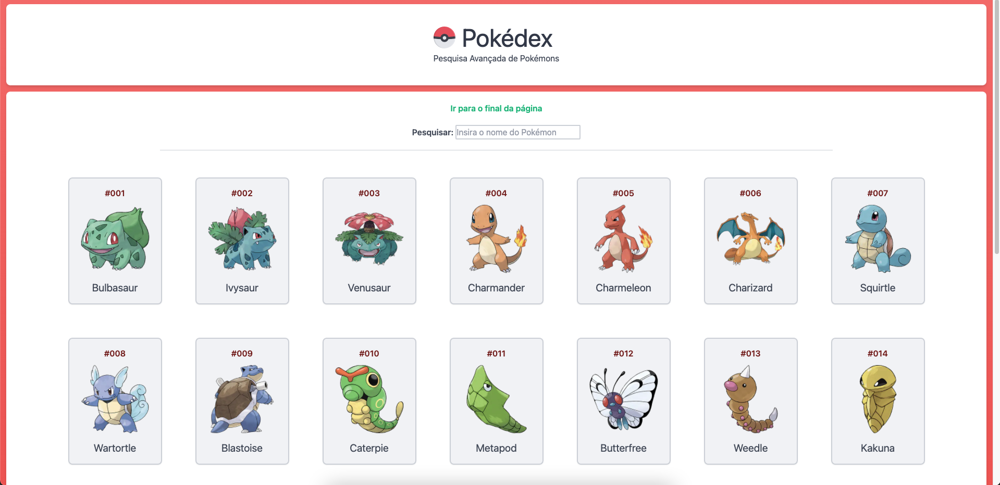
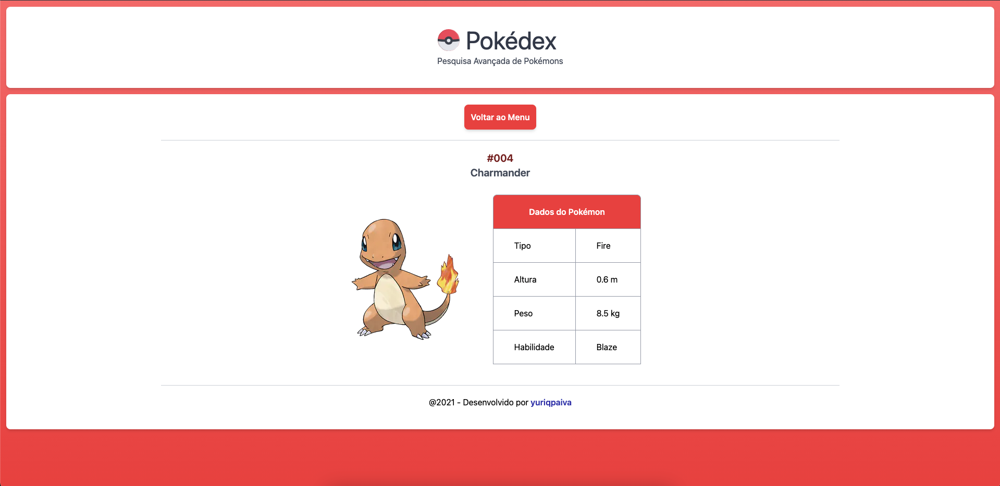

# Pokedéx

App de pesquisa de Pokémons ou "Pokedéx" feito com NextJS e TailWindCSS

# Como funciona?

Para instalar as dependências do Node utilize o comando no terminal da pasta:
```
npm i
```

Para rodar a aplicação React localmente, em modo de desenvolvimento, utilize o seguinte comando no terminal da pasta:
```
npm run dev
```

# Explicando o projeto

Este projeto busca fornecer ao usuário uma lista completa de Pokémons da região de Kanto, ao clicar nos Pokémons é possível obter algumas informações sobre eles. Foi utilizada uma integração com a PokeAPI


